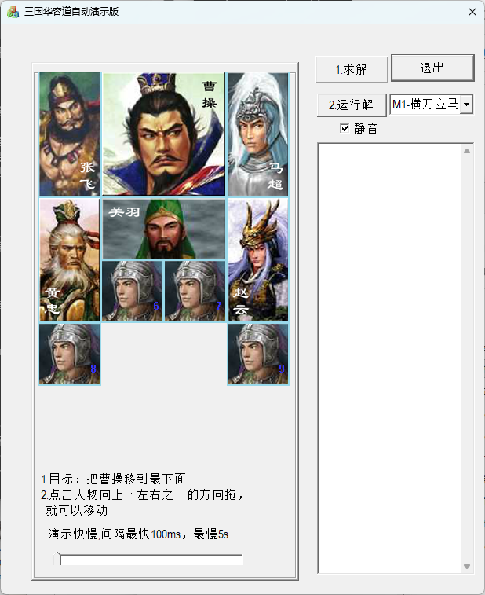

# MFC 曹操华容道

经典滑块益智游戏**华容道**（Klotski）的 Windows 桌面版，内置 BFS 自动求解与演示，使用 **Visual Studio 2022（C++ / MFC / v143 工具集）** 开发。

  



## 功能特性

- **多个经典棋局**：横刀立马、四路进兵等，下拉框切换；棋局文件可自行扩展，见 [棋局文件格式](docs/棋局文件格式.md)
- **自动求解**：内置 BFS 广度优先搜索求解器，一键算出通关步骤
- **自动演示**：点"运行解"自动播放求解步骤，演示间隔 100ms ~ 5s 可调
- **三国人物棋子**：张飞、曹操、马超、黄忠、关羽、赵云手绘位图棋子
- **背景音乐**：可静音，音乐文件 `bin/bk.mp3`

## 快速上手

1. 把**曹操**（2×2 大块）移到底部出口即获胜
2. 按住棋子向上下左右拖动即可移动
3. 点 **1求解** 计算步骤 → 点 **2运行解** 观看自动演示

## 下载

无需编译，到 [Releases](https://github.com/foolpanda/MFCcaocaohrd/releases) 下载压缩包（x64 为 64 位，x86 为 32 位），解压运行 `MFCcaocaohrd_xxx.exe` 即可。

> 压缩包内已包含棋局文件 `sanguohrd.txt` 和音乐 `bk.mp3`，请保持它们与 exe 在同一目录。Release 版为**静态链接**，无需安装任何 VC 运行库。

## 文档

| 文档 | 内容 |
|------|------|
| [棋局文件格式](docs/棋局文件格式.md) | `sanguohrd.txt` 的编号规则、类型定义、编写方法，附 8 棋局[参考棋局集](docs/sanguohrd-参考棋局集.txt) |
| [经典阵法图鉴](docs/经典阵法图鉴.md) | 横刀立马、过五关等经典阵法布局图与最少步数 |
| [数学原理](docs/数学原理.md) | 排列组合、逆序数、奇偶性、最短路径——求解器背后的数学 |

## 从源码编译

1. 安装 **Visual Studio 2022**（勾选"使用 C++ 的桌面开发"工作负载，其中包含 MFC 库）
2. 双击打开 `MFCcaocaohrd.sln`
3. 选择 `Release | x64`（或 `Release | x86`）配置
4. 按 **F7** 或 **Ctrl+Shift+B** 生成，输出位于 `bin/` 目录

> Release 配置使用静态链接（MFC/CRT 打进 exe），Debug 配置为动态链接便于调试。

## 项目结构

```
MFCcaocaohrd.sln          VS2022 解决方案
MFCcaocaohrd/             源代码目录
├── MFCcaocaohrd.cpp/h    应用程序类（读取棋局、播放音乐）
├── MFCcaocaohrdDlg.cpp/h 主对话框（求解/演示/棋局切换）
├── QZ.cpp/h              棋子类 + BFS 求解器
├── TStage.cpp/h          棋局/关卡数据结构
├── WNDChess.cpp/h        棋子窗口（拖动消息处理）
├── CDemoThread.cpp/h     自动演示线程
├── Direction.cpp/h       方向定义
├── res/ res2/ res3/      位图、图标、音乐等资源
└── bin/                  编译输出与运行时数据文件
docs/                     图文文档（格式说明/阵法图鉴/数学原理）
.github/workflows/        CI：打 v* 标签自动编译并发布 Release
```

## License

仅供学习交流使用。
