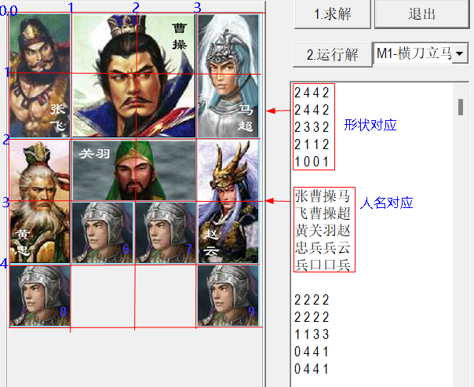

# 棋局文件格式说明

游戏启动时从 **exe 同目录**读取 `sanguohrd.txt` 加载全部棋局（下拉框里的 M1、M2…就来自这里）。想增加棋局，按本文格式往文件里追加即可。

## 棋子编号规则

程序内部把棋盘上的 12 个位置固定编号，写棋局文件时按此编号填写：

| 编号 | 0 | 1 | 2 | 3 | 4 | 5 | 6~9 | 10、11 |
|------|---|---|---|---|---|---|-----|--------|
| 棋子 | 张飞 | 曹操 | 马超 | 黄忠 | 关羽 | 赵云 | 兵 | 空位 |

> 10 和 11 必须为空位，空位的最后一个数字填写 0 或 1 皆可。

## 形状类型

| 类型 | 含义 | 占格 |
|------|------|------|
| 0 | 空 | 1×1 |
| 1 | 兵 | 1 行 × 1 列 |
| 2 | 竖将（张飞、马超、黄忠、赵云） | 2 行 × 1 列 |
| 3 | 横将（关羽） | 1 行 × 2 列 |
| 4 | 曹操 | 2 行 × 2 列 |

## 文件格式

- `#` 开头为注释行
- `M1-横刀立马` 这类 `M数字-名称` 行定义一个新棋局
- 之后每行一条：`编号　行　列　类型`（行 0~4，列 0~3，从左上角开始）

以经典开局**横刀立马**为例：

```
M1-横刀立马
0  0 0  2      # 0号张飞，第0行第0列，竖将
1  0 1  4      # 1号曹操，第0行第1列，2×2
2  0 3  2      # 2号马超，第0行第3列，竖将
3  2 0  2      # 3号黄忠，第2行第0列，竖将
4  2 1  3      # 4号关羽，第2行第1列，横将
5  2 3  2      # 5号赵云，第2行第3列，竖将
6  3 1  1      # 6号兵，第3行第1列
7  3 2  1      # 7号兵，第3行第2列
8  4 0  1      # 8号兵，第4行第0列
9  4 3  1      # 9号兵，第4行第3列
10 4 1  1      # 10号空位
11 4 2  1      # 11号空位
```

对应到棋盘上的效果（红字为行列坐标）：



## 注意事项

- **编码**：游戏是 MBCS 程序，游戏实际读取的 `sanguohrd.txt` 需保存为 **GBK/ANSI 编码**才能正确显示中文棋局名；本仓库提供的 [参考棋局集](sanguohrd-参考棋局集.txt) 已转为 UTF-8 便于在线阅读，若要给游戏使用请先转回 ANSI。
- 仓库 `bin/sanguohrd.txt` 默认只带 2 个棋局，[参考棋局集](sanguohrd-参考棋局集.txt) 含 8 个棋局（横刀立马、四路进兵、五将逼宫、巧过五关、兵临曹营、层层设防、前呼后拥、守口如瓶），可自行替换。
- 同类型武将（编号 0、2、3、5）在求解器看来可互换，位置按阵法需求摆放即可。
