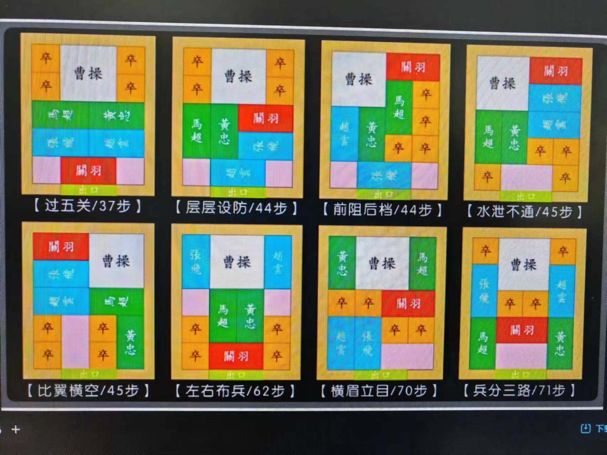
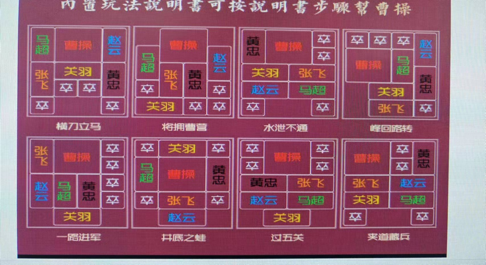
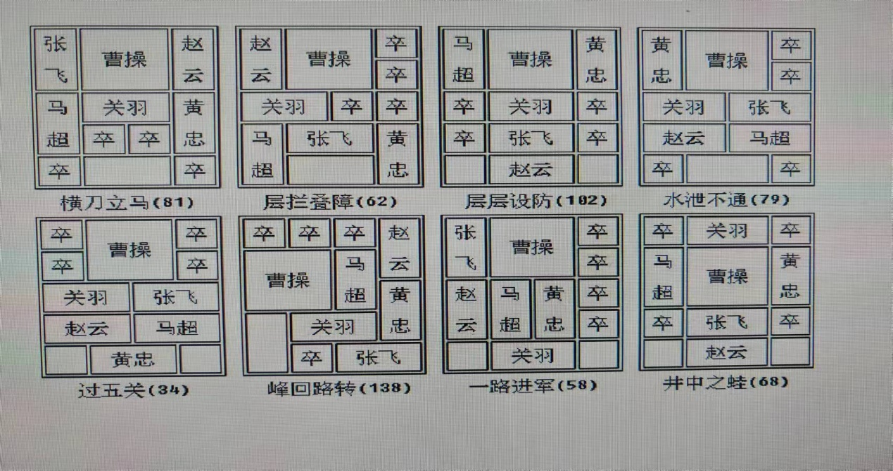

# 经典阵法图鉴

华容道流传的经典开局阵法。第一张图标注了每种阵法的**最少步数**（不同资料统计口径略有差异）。

## 经典阵法与最少步数

| 阵法 | 最少步数 | 阵法 | 最少步数 |
|------|---------|------|---------|
| 横刀立马 | 81 | 过五关 | 34 |
| 层拦叠障 | 62 | 峰回路转 | 138 |
| 层层设防 | 102 | 一路进军 | 58 |
| 水泄不通 | 79 | 井中之蛙 | 68 |

## 实体玩具内置玩法

市面经典华容道玩具的内置玩法说明书（可按说明书步骤帮曹操突围）：

阵法：横刀立马、将拥曹营、水泄不通、峰回路转、一路进军、井底之蛙、过五关、夹道藏兵。

## 优化后的最优步数参考

另一份资料给出的最优步数（部分阵法在不同约束下步数不同，如是否计入同子移动）：

| 阵法 | 最少步数 | 阵法 | 最少步数 |
|------|---------|------|---------|
| 过五关 | 37 | 比翼横空 | 45 |
| 层层设防 | 44 | 左右布兵 | 62 |
| 前阻后档 | 44 | 横眉立目 | 70 |
| 水泄不通 | 45 | 兵分三路 | 71 |

> 想在游戏里玩这些阵法？按 [棋局文件格式](棋局文件格式.md) 把阵法写进 `sanguohrd.txt` 即可，[参考棋局集](sanguohrd-参考棋局集.txt) 里已收录 8 个。
